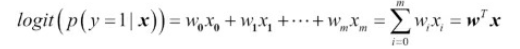
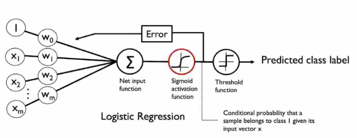

# Heart_Disease_Prediction

## Introduction
Each year due nearly 12 million deaths occur worldwide due to Heart diseases as estimated by World Health Organisation. More the 50% of these deaths are due to cardio vascular diseases, thus early identification of such diseases can help in making changes in the lifestyle of an individual to reduce complications and save the victim. This project aims in identifying most relevant risk factors as well as predict the overall risk of Heart disease using `Logistic Regression`.

-----------------------------------------------

## Dataset
The dataset is taken from [Kaggle](https://www.kaggle.com/dileep070/heart-disease-prediction-using-logistic-regression) i.e. publically available and is formed on ongoing cardiovascular study on residents of the town of `Framingham, Massachusetts`. The goal is to predict whether the patient has a 100year risk of future `Coronary Heart Disease(CHD)`.

The dataset provides patient's information and includes over `4000 records and 15 attributes`, where each attribute is potential risk factor.

---------------------------------------------

## Logistic Regression

Inspite of it's name `logistic regression` is a model for classification and not regression.
* **Intuition and Conditional Probabilities**
    * It is a classification model that performs really well on `linearly seperable classes`.
    * LR is a probabilistic mode and for understanding this note the following :
        * , where 'p' is the probability of the positive event.
        * , it takes inputs in range (0,1) and transform them to values over the entire real number.
        * , here p(y=1|x) is the conditional probability that a particular sample belongs to class 1 given its features x.
* Actually we are interested in predicting the probability that a certain sample belongs to a particular class, that's inverse of a logit function and is called `logistic sigmoid function` 
* 
* LR not just predicts the class label but also tells us the chance that patient has a particular disease given certain symptoms and thus LR is highly useful in the field of medicine.

----------------------------------

## Contributer
[Shrikant Kendre](https://github.com/shriawesome)
    